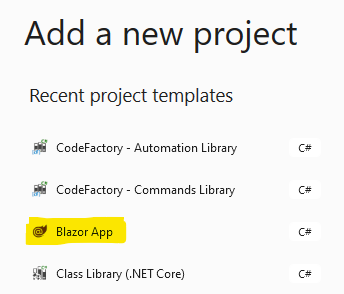
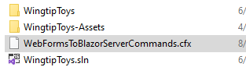
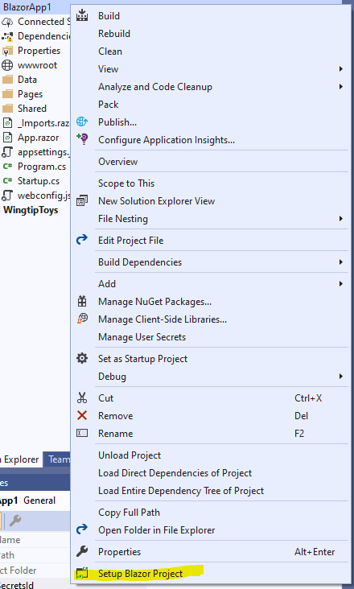
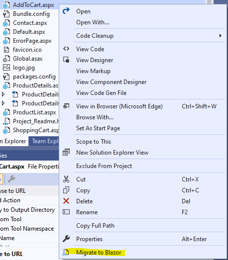

# WebFormsToBlazorServer Guidance
This set of documentation goes into the details of the example CodeFactory Code Automation Template **WebFormsToBlazor**.  If you need explainations of what a Code Automation Template is or how CodeFactory works please use the following link to that documentation.  [CodeFactory Guidance](http://docs.codefactory.software/guidance/intro.html)

## Template Overview
In order to make use of this template you will need to have a target WebForms solution, in our examples below we reference the [*WingTipToys*](https://github.com/corn-pivotal/wingtiptoys) project.  This is an older reference project that is freely available to anyone who wished to download it and give this template a try.  Once you have your project open inside of Visual Studio - go ahead and add a new Project to the solution of type Blazor - Server.

The compiled output of the WebFormsToBlazorServer project, a file called *WebFormsToBlazorServerCommands.cfx* file just needs to be dropped into the root solution folder of the WebForms project.

  

The next time that you open the WingTipToys solution the CodeFactory runtime will [load](http://docs.codefactory.software/guidance/usage-intro.html#consume-the-automation-template) the package and make the command available for use.

## Commands
There are currently two(2) commands that have been built inside of the project; 

- SetupBlazorProject
- MigrateWebForm

The first command, *SetupBlazorProject*, is an implementation of a [Project Command](http://docs.codefactory.software/guidance/overview-commands-intro.html) type and can be found by right-clicking on the Blazor project in your solution.  The command is found at the bottom of the context menu.

The second command, *MigrateWebForm*, is an implementation of a [Project Document Command](http://docs.codefactory.software/guidance/overview-commands-intro.html) type and can be found by right-clicking on any *.aspx file that is found in the *WingTipToys* project.

## Project Structure
The following folders are found in this project.

### Commands
This folder is further broken down into command type folders.  Please click on each item found below to get further details.
#### Document
Name | Description
-----|-------
MigrateWebForm.cs | This is a [Project Document](http://docs.codefactory.software/guidance/overview/commands/projectdocument.html) command type that is built to migrate a single *.aspx file from the source WebForms project into an equivalent Blazor Page Component file in the target Blazor Server project.  Please click [here](MigrateWebFormCommand.md) for more details

#### Project
Name | Description
-----|-------
SetupBlazorProject.cs | This is a [Project](http://docs.codefactory.software/guidance/overview/commands/project.html) command type that will allow a developer to bulk-migrate an **entire** WebForms appliction including all of its logic, configuration and static assets into a Blazor Server application.  Please click [here](SetupBlazorProjectCommand.md) for more details.
### Dialogs
Name | Description
-----|-------
DialogExtensions.cs | This is a standard C# static class that contains a few helper extension methods for dealing with the other two dialogs in the project.  Please click [here](DialogExtensionsFile.md) for more details.
MigrateWebForm.xaml/xaml.cs | This is a CodeFactory specific WPF UserControl that is used displayed during the execution of the [Migrate WebForm](MigrateWebFormCommand.md) command.  Please click [here](MigrateWebFormDialogFile.md) for more details.
MigrateStepStatus.cs | This is a standard C# POCO object that is used to pass information back to the [MigrateWebForm](MigrateWebFormDialogFile.md) WPF user control in order to be displayed to the developer/user.  Please click [here](MigrationStepStatusFile.md) for more details.
SetupBlazorDialg.xaml/xaml.cs | This is a CodeFactory specific WPF UserControl that is displayed during the execution of the [SetupBlazorProject](SetupBlazorProjectCommand.md) command.  Please click [here](SetupBlazorDialogFile.md) for more details.

### Migration
Name | Description
-----|-------
AspxToBlazorControlConverter.cs | This is a C# class which is the adaptee of the [ConverterAdapter](ConverterAdapterFile.md) class.  It understands how to convert WebForms/ASP.NET controls into Blazor equivalents.  Please click [here](AspxToBlazorConverterFile.md) for more details.
ControlConverterBase.cs | This is a C# class that all adaptee classes, like the above [AspxToBlazorControlConverter.cs](AspxToBlazorConverterFile.md), inherit from in order to comply with the pattern as implemented by the ConverterAdapter class.  Please click [here](ControlConverterBaseFile.md) for more details.
ConverterAdapter.cs | This is the main adapter class that is used by logic found in a number of the methods from the [WebFormToBlazorMigration](WebFormToBlazorServerMigrationFile.md) partial classes definitsion.  Please click [here](ConverterAdapterFile.md) for more details.
IControlConverter.cs | This is a standard C# Interface object used by the ControlConverterBase class.  Please click [here](IControlConverterFile.md) for more details.
IMigrationStatusUpdate.cs | This is a standard C# Interface object used by the migration logic to pass information back up to both of the dialog classes during exectuion.  Please click [here](IMigrationStatusUpdateFile.md) for more details.
ITagControlConverter.cs | This is a standard C# Interface object that defines a single method that is to be implemented by any ControlConverter the is authored.  Please click [here](ITagControlConverterFile.md) for more details.
MessageTypeEnum.cs | This is a standard C# Enumeration object that is leveraged during status updates from any migration logic to a running dialog during either of the commands.  Please click [here](MessageTypeEnumFile.md) for more details.
MigrationExtensionMethods.cs | This is a standard C# static class that contains several helper methods which are leveraged by migration logic found in other areas of the project.  Please click [here](MigrationExtensionMethodsFile.md) for more details.
MigrationStatusEnum.cs | This is a standard C# Enumeration object that is leveraged during status updates from any migration logic to a running dialog during either of the commands.  Please click [here](MigrationStatusEnumFile.md) for more details.
MigrationStepEnum.cs | This is a standard C# Enumeration object that is leveraged during status updates from any migration logic to a running dialog during either of the commands.  Please click [here](MigrationStepEnumFile.md) for more details.
MigrationSteps.cs | This is a standard C# POCO that holds information on which steps of the [SetupBlazorProject](SetupBlazorProjectCommand.md) command dialog, [SetupBlazorDialog](SetupBlazorDialogFile.md) for more details.
WebFormToBlazorServerMigration.cs | This is a C# *partial* class definition which contains all of the logic for migrating the different parts of a WebForms project into a Blazor Server application.  This class is called by the [SetupBlazorDialog](SetupBlazorDialogFile.md) WPF User dialog.  Please click [here](WebFormToBlazorServerMigrationFile.md) for more details.
WebFormToBlazorServerMigration.AspxFiles.cs | This is a C# *partial* class definition which contains logic **specific** to the conversion of any *.aspx pages that are found in the source WebForms project.  Please click [here](WebFormToBlazorServerMigrationAspxFileFile.md) for more details.
WebFormToBlazorServerMigration.Bundling.cs | This is a C# *partial* class definition which contains logic **specific** to the migration of any scripts that are bundled up in the source WebForms project over to the target Blazor project.  Please click [here](WebFormToBlazorServerMigrationBundlingFile.md) for more details.
WebFormToBlazorServerMigration.Config.cs | This is a C# *partial* class definition which contains logic **specific** to the migration of app.config/web.config data that are found in the source WebForms project.  Please click [here](WebFormToBlazorServerMigrationConfigFile.md) for more details.
WebFormToBlazorServerMigration.HttpModules.cs | This is a C# *partial* class definition which contains logic **specific** to the migration of any HttpModules that have been customized/defined within the source WebForms project.  Please click [here](WebFormToBlazorServerMigrationHttpModulesFile.md) for more details.
WebFormToBlazorServerMigration.Logic.cs | This is a C# *partial* class definition which contains logic **specific** to the migration of any *.cs class documents that are found in the source WebForms project.  Please click [here](WebFormToBlazorServerMigrationLogicFile.md) for more details.
WebFormToBlazorServerMigration.Startup.cs | This is a C# *partial* class definition which contains logic **specific** to the migration of the startup.cs code found in the source WebForms project.  Please click [here](WebFormToBlazorServerMigrationStartupFile.md) for more details.
WebFormToBlazorServerMigration.StaticFiles.cs | This is a C# *partial* class definition which contains logic **specific** to the migration of any images or script files that are found in the source WebForms project.  Please click [here](WebFormToBlazorServerMigrationStaticFilesFile.md) for more details.

### Templates
Name | Description
-----|-------
BundleConfigFactory.tt/.cs/transform.cs/ | This is a T4 template that is used to transform and output javascript bundling found in the source WebForms project.  Please click [here](BundlingConfigFactoryFile.md) for more details.
LogicCodeFactory.tt/.cs/transform.cs/ | This is a T4 template that is used to transform any of the C# class defintion found in the source WebForms project.  Please click [here](LogicCodeFactoryFile.md) for more details.
MiddlewareConversion.tt/.cs/transform.cs/ | **Depricated and not currently in use**
ModuleFactory.tt/.cs/transform.cs/ | This is a T4 template that is used to transform any of the code located within the source WebForms project that inherits from HttpModule. Please click [here](ModuleFactoryFile.md) for more details.
PageCodeBehindFactory.tt/.cs/transform.cs/ | This is a T4 template that is used to output code which is found in any of the *.aspx.cs code-behind file that are found inside of the source WebForms project.  Please click [here](PageCodeBehindFile.md) for more details.
